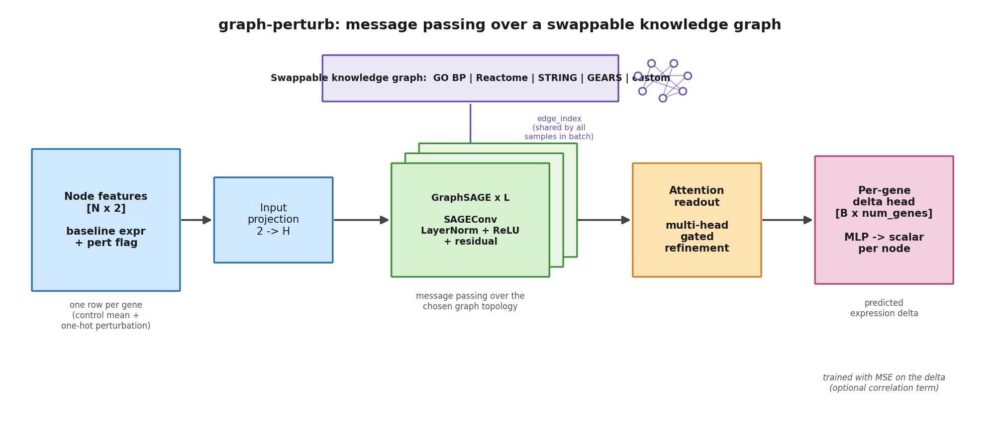

# graph-perturb

**Predict single-cell gene-perturbation responses with a GNN over a _swappable_ biological knowledge graph.**


---

## Problem statement

Pooled CRISPR screens read out with single-cell RNA-seq (**Perturb-seq**) let us
measure the transcriptome-wide response to perturbing individual genes — and, with
combinatorial guides, to perturbing *pairs* of genes at once. The number of possible
perturbations (and especially perturbation *combinations*) is astronomically larger
than any screen can cover experimentally, so we want a model that, given the
perturbation(s) applied, **predicts the resulting per-gene change in expression**
(the "delta" relative to control).

The hard part is **generalization to the unseen**:

- **Unseen single perturbations** — predict the response to a gene that was never
  perturbed on its own during training.
- **Unseen combinations** — predict the response to a *pair* of perturbations when
  neither that exact pair (and possibly neither member individually) was seen.

`graph-perturb` evaluates these two regimes **separately** (`test_single` and
`test_combo`) because they probe different kinds of extrapolation, and it leans on a
biological **graph prior** — genes that are functionally related should respond in
related ways — to bridge from seen to unseen perturbations.

---

## The "swappable graph" thesis

The central design claim of this package is simple:

> **The same GNN should run, unchanged, over any gene–gene knowledge graph — and you
> should be able to switch which biological prior it uses by changing one line of
> config.**

A perturbation model that bakes in one particular network conflates two questions:
"is graph-based message passing useful?" and "is *this* graph the right one?".
`graph-perturb` separates them. Every backend implements the same tiny
`GraphSource` contract and produces a `PerturbationGraph` aligned to the experiment's
gene universe, so the GNN never knows (or cares) which biological source the edges
came from.

| Backend (registry key) | Hydra group (`graph=`) | Biological prior |
| --- | --- | --- |
| `go_bp`   | `graph=go`       | Gene Ontology **Biological Process** co-membership |
| `reactome`| `graph=reactome` | **Reactome** pathway co-membership |
| `string`  | `graph=string`   | **STRING** protein–protein interactions (edge-weighted by combined score) |
| `gears`   | `graph=gears`    | A **GEARS**-format gene-relationship file (adapter) |
| `custom`  | `graph=custom`   | Your own edge list (CSV/TSV of gene-symbol pairs + optional weight) |

Because the graph is the only thing that changes, you get a **controlled,
backend-vs-backend comparison** of which prior actually helps — same model, same
splits, same metrics, different graph. That comparison is a first-class command
(`compare-backends`).

---

## Install

Requires **Python ≥ 3.11**. A CPU-only PyTorch install is fine (the package and all
smoke tests run on CPU).

```bash
git clone <repo-url> graph-perturb
cd graph-perturb
pip install -e .            # add .[dev] for pytest/ruff/jupyter
```

Raw GO / Reactome / STRING dumps are large, so they are **not** cached inside the
repo. By default they go to `~/.graph_perturb_cache`; override the location with the
`GRAPH_PERTURB_CACHE` environment variable (or pass `cache_dir=` / `graph.cache_dir`
explicitly):

```bash
export GRAPH_PERTURB_CACHE=/path/to/big/volume/graph_perturb_cache
```

---

## Quickstart (CLI)

The console script is `graph-perturb` (Typer). Every command that touches data has a
`--synthetic` fast path that fabricates a tiny dataset and uses an offline graph
fallback, so it runs in well under a minute on CPU with **no downloads** — ideal as a
smoke test.

**List the swappable backends:**

```bash
graph-perturb graphs
```

**Build a graph over the gene universe and inspect it:**

```bash
# offline smoke test (fabricated genes + offline fallback edges)
graph-perturb build-graph --backend go_bp --synthetic

# real path: builds over Norman HVGs (downloads/caches the source dump)
graph-perturb build-graph --backend reactome --n-top-genes 2000
```

**Train.** The fast path is fully offline; the real path is Hydra-composed from
`configs/` and accepts standard dotlist overrides:

```bash
# fast offline smoke run (tiny epochs, synthetic data)
graph-perturb train --synthetic --graph go_bp --model gnn --epochs 3

# real Hydra run: GraphSAGE GNN over the Reactome graph
graph-perturb train graph=reactome model=gnn

# override anything on the command line, just like hydra
graph-perturb train graph=string model=vae train.epochs=5 data.n_top_genes=4000
```

**Evaluate a checkpoint:**

```bash
graph-perturb evaluate --ckpt checkpoints/best.pt --synthetic
graph-perturb evaluate --ckpt checkpoints/best.pt graph=reactome model=gnn
```

**Compare backends** — train the *same* model on each graph over the *same* split and
print one backend-vs-backend table (this is the swappable-graph thesis as a command):

```bash
graph-perturb compare-backends --backends go_bp,reactome,string --synthetic
graph-perturb compare-backends --backends go_bp,reactome,string --model gnn
```

**Bakeoff** — train a GNN and the VAE baseline on the same split and print a
GNN-vs-VAE table:

```bash
graph-perturb bakeoff --synthetic --graph go_bp
graph-perturb bakeoff graph=reactome
```

---

## Results

> **Illustrative layout — numbers are placeholders, not measured results.**
> The tables below show the *shape* of the output produced by `compare-backends` and
> `bakeoff` on the real Norman 2019 Perturb-seq dataset. The cookbook notebooks
> reproduce them end-to-end; the specific values here are an example layout only and
> should not be cited as real measurements. Higher is better for the Pearson and
> overlap columns; lower is better for MSE.

**Graph backend swap** (same GraphSAGE model, `test_combo` split):

| Graph backend | Pearson (delta) | Per-gene Pearson | MSE | overlap@20 |
| --- | ---: | ---: | ---: | ---: |
| GO BP    | 0.62 | 0.41 | 0.085 | 0.55 |
| Reactome | 0.64 | 0.43 | 0.081 | 0.58 |
| STRING   | 0.60 | 0.39 | 0.088 | 0.52 |

**Model bakeoff** (GNN over GO BP vs. conditional VAE baseline, `test_single` split):

| Model | Pearson (delta) | Per-gene Pearson | MSE | overlap@20 |
| --- | ---: | ---: | ---: | ---: |
| GNN (GraphSAGE) | 0.71 | 0.49 | 0.067 | 0.63 |
| VAE (baseline)  | 0.66 | 0.44 | 0.074 | 0.58 |

Metric definitions (see `graph_perturb/metrics.py`): **Pearson (delta)** is the mean
per-condition Pearson r across genes; **per-gene Pearson** is the mean per-gene
Pearson r across conditions; **MSE** is computed on the delta; **overlap@20** is the
mean fraction of the true top-20 differentially-expressed genes recovered in the
predicted top-20.

---

## Architecture



*(Regenerate with `python docs/make_architecture_figure.py`.)*

Each node in the chosen knowledge graph is a gene, carrying **two input features**:
its **baseline state** (control-mean expression) and a binary **perturbation flag**
that is set on the nodes whose genes were perturbed in this sample. The forward pass:

1. **Input projection** maps the `[N, 2]` node features to the hidden width.
2. **Stacked GraphSAGE layers** propagate information along the edges of the
   *selected* knowledge graph (`SAGEConv` → LayerNorm → ReLU → dropout, with a
   residual connection). The graph topology is shared by every sample in a batch.
3. **Attention readout** applies a multi-head, gated refinement over the node
   embeddings.
4. A **per-gene delta head** (MLP) emits one scalar per node, reshaped to the dense
   `[B, num_genes]` predicted expression delta.

Training optimizes MSE on the delta (with an optional per-sample correlation term).
The VAE baseline (`model=vae`) ignores the graph entirely — it conditions a
conditional VAE on the perturbation flag — which is exactly what makes the
GNN-vs-VAE bakeoff a fair test of whether the graph prior helps.

---

## Cookbook

Worked, end-to-end notebooks live in `cookbook/` (each loads real Norman 2019
Perturb-seq via `load_norman`, with an automatic synthetic offline fallback, and
prints which mode it is in):

1. **`01_predict_heldout_single.ipynb`** — full pipeline: load data → build a GO BP
   graph → `make_splits` → train the GraphSAGE GNN → predict a **held-out single
   CRISPRa perturbation**, with predicted-vs-true delta plots and per-split metrics.
2. **`02_compare_backends.ipynb`** — the swappable-graph thesis in action: GO BP vs.
   Reactome vs. STRING under identical model and splits (`compare_backends`).
3. **`03_gnn_vs_vae.ipynb`** — GraphSAGE vs. the conditional VAE baseline to isolate
   the contribution of the graph prior (`compare_models`).
4. **`04_custom_graph.ipynb`** — bring your own graph: build a custom edge-list CSV
   and plug it in via `get_graph_source("custom", ...)`; also demos the **GEARS**
   adapter and the lossless **AnnData round-trip**.

**Bonus — GEARS / AnnData interop:** `anndata_to_processed` and
`processed_to_anndata` (in `graph_perturb.data`) round-trip between `AnnData` and the
package's `ProcessedPerturbData`, and the `gears` backend (`graph=gears
graph.options.path=...`) ingests a GEARS-format gene-relationship file as the graph.

---

## License

`graph-perturb` is licensed under the **GNU General Public License v3.0 or later
(GPL-3.0-or-later)**. See the [`LICENSE`](LICENSE) file for the full text.
